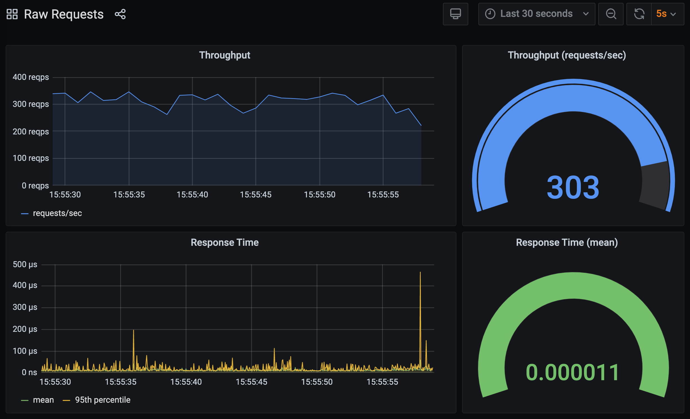

The most basic aim of collecting metrics from a web application is to record the number of HTTP requests it receives and how long the requests take to be handled. This will give you an idea of how popular your web site is, how well it is performing, and thus whether a user of your web site might be happy using your site.

For Python WSGI applications, all HTTP requests are handled through a single WSGI application callable object, or entrypoint. The most obvious approach for recording details about HTTP requests, is thus to apply a wrapper to that entrypoint to record details of calls.

Open up the code file for our next example WSGI application. This can be found in `~/exercises/hello-world-v2/wsgi_1.py`.

```editor:open-file
file: ~/exercises/hello-world-v2/wsgi_1.py
```

In this version of our WSGI application we have added the `@metrics.function_call` decorator.

```editor:select-matching-text
text: "@metrics.function_call"
file: ~/exercises/hello-world-v2/wsgi_1.py
```

The implementation of the decorator is in the separate file `~/exercises/hello-world-v2/metrics.py`.

```editor:open-file
file: ~/exercises/hello-world-v2/metrics.py
```

The decorator is implemented using the [wrapt](https://wrapt.readthedocs.io/) Python module, with comments in the code explaining what is happening.

```editor:select-matching-text
text: "def function_call\\(.*\\):"
file: ~/exercises/hello-world-v2/metrics.py
isRegex: true
before: 1
```

The result is that a metric corresponding to each call is reported into InfluxDB, with the time the call completed, and how long the call took being recorded. This is done using the `write_points()` method of the InfluxDB client.

```editor:select-matching-text
text: "client.write_points\\(.*"
file: ~/exercises/hello-world-v2/metrics.py
isRegex: true
after: 12
```

To test the WSGI application with the decorator applied for collecting metrics, back in the first terminal run:

```terminal:execute
command: mod_wsgi-express start-server hello-world-v2/wsgi_1.py --log-to-terminal --working-directory hello-world-v2
```

To simulate a batch of HTTP requests being sent to the WSGI application, the `bombardier` HTTP benchmarking program can be used. Run in the second terminal:

```terminal:execute
command: bombardier -d 120s -c 5 http://localhost:8000
session: 2
```

Once running, and HTTP requests are being received by the WSGI application, jump over to the **Raw Requests** dashboard in Grafana.

```dashboard:reload-dashboard
name: Grafana
url: {{ingress_protocol}}://{{session_namespace}}-grafana.{{ingress_domain}}{{ingress_port_suffix}}/d/raw-requests?orgId=1&refresh=5s
```

As the charts fill out, you should see something similar to what is shown by the following screenshot.



The actual numbers you see for throughput and response time may be somewhat different. This is because what you get can depend on the specific computer it is run on, how powerful the CPU is, and what resources are available.

This is the first trap of performing benchmarking of web applications. The results you get on one system doesn't mean that is how it will perform on another.

Further, in this case we are running the benchmarking tool on the same host as where the application is running, meaning the benchmarking tool is stealing away CPU cycles that could have been used by the web application, thus affecting its performance.

There are various other mistakes one can make when trying to perform benchmarking and instrumenting web applications. We will touch on a range of these as we go along, but right now we have an even bigger problem, which is our decorator will record incorrect results for certain ways that a WSGI application can be implemented.

Stop `bombardier` if it is still running, as well as the WSGI application.

```terminal:interrupt-all
```
