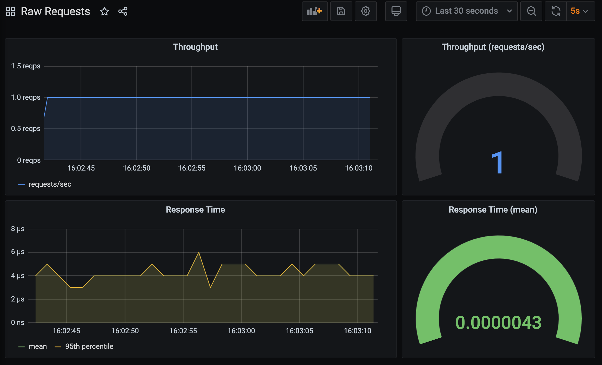

To illustrate the problem, let's change our WSGI application source code slightly.

Open up the modified code in `~/exercises/hello-world-v2/wsgi_2.py`.

```editor:open-file
file: ~/exercises/hello-world-v2/wsgi_2.py
```

The change we have made is to replace the `return` statement in the WSGI application which previously returned the content for the response, with a `yield` statement.

```editor:select-matching-text
text: "yield output"
file: ~/exercises/hello-world-v2/wsgi_2.py
```

This change has the effect of turning the function into a generator.

To show why this is a problem, we have also added a delay into the execution of the function. This is done by calling `time.sleep()`.

```editor:select-matching-text
text: "time.sleep(0.05)"
file: ~/exercises/hello-world-v2/wsgi_2.py
```

With the delay added, we would expect the response time for the WSGI application to be in the order of 0.05 seconds.

Start up the WSGI application:

```terminal:execute
command: mod_wsgi-express start-server hello-world-v2/wsgi_2.py --log-to-terminal --working-directory hello-world-v2
```

To make things clearer, this time we will send HTTP requests at a rate of only 1 request/sec, rather than trying to send as many requests as we can.

```terminal:execute
command: bombardier -d 120s -c 1 -r 1 http://localhost:8000
session: 2
```

Jump over to the **Raw Requests** dashboard in Grafana again.

```dashboard:reload-dashboard
name: Grafana
url: {{ingress_protocol}}://{{session_namespace}}-grafana.{{ingress_domain}}{{ingress_port_suffix}}/d/raw-requests?orgId=1&refresh=5s
```

What you would think you should see is a response time of about 0.05 seconds, but in fact the response time is being shown as much less, in the order of micro seconds.



The reason this is the case is that when `yield` is used and the function turned into a generator, the time being recorded is that needed to create the generator object and return it. The decorator as written isn't going to record the time taken to execute the body of the function, nor the time taken to consume everything yielded up by the generator.

As a consequence, for WSGI applications you cannot use a normal decorator to time how long it takes to handle HTTP requests. Instead, we need to use a wrapper implementation that handles the fact that the WSGI application could be implemented as a generator, or any other type of iterable object, and which works with the WSGI application protocol specification for closing out a request.

Stop `bombardier` if it is still running, as well as the WSGI application.

```terminal:interrupt-all
```
