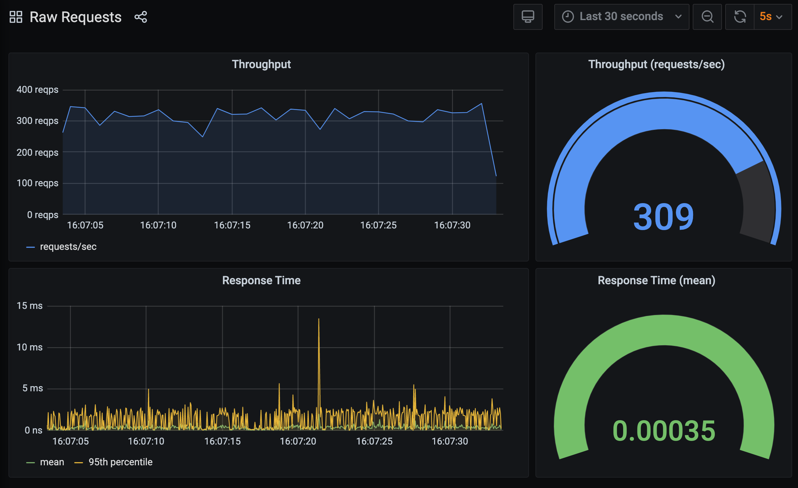

For a WSGI application, we therefore need a more complicated wrapper to be able to track HTTP requests. Such a wrapper can be found in `~/exercises/hello-world-v3/metrics.py`.

```editor:open-file
file: ~/exercises/hello-world-v3/metrics.py
```

This time the decorator is called `@wsgi_application`.

```editor:select-matching-text
text: "def wsgi_application\\(.*\\):"
file: ~/exercises/hello-world-v3/metrics.py
isRegex: true
before: 1
```

In this decorator we still intercept the initial call, but we wrap up the result of the call to the original WSGI application with a transparent proxy object. This proxy object intercepts the `close()` method that WSGI servers are required to call at the completion of any HTTP request. It is in this `close()` method that we can record the metric for how long the request takes.

If interested in the details, read through the source code. Comments are included to try and explain what is occuring, and how certain error conditions are catered for.

Now open up our modified WSGI application code file.

```editor:open-file
file: ~/exercises/hello-world-v3/wsgi_1.py
```

You will see that all we have done is swap out the prior decorator with the new one.

```editor:select-matching-text
text: "@metrics.wsgi_application"
file: ~/exercises/hello-world-v3/wsgi_1.py
```

To test the decorator does what is required, start up the WSGI application:

```terminal:execute
command: mod_wsgi-express start-server hello-world-v3/wsgi_1.py --log-to-terminal --working-directory hello-world-v3
```

and send through a stream of requests at the rate of 1 request/sec again.

```terminal:execute
command: bombardier -d 120s -c 1 -r 1 http://localhost:8000
session: 2
```

Jump over to the **Raw Requests** dashboard in Grafana.

```dashboard:reload-dashboard
name: Grafana
url: {{ingress_protocol}}://{{session_namespace}}-grafana.{{ingress_domain}}{{ingress_port_suffix}}/d/raw-requests?orgId=1&refresh=5s
```

The result this time should be the 0.05 second response time we expect.


Stop `bombardier` if it is still running, as well as the WSGI application.

```terminal:interrupt-all
```

Before we continue, let's go back and test this new decorator and wrapper without the time delay.

```editor:open-file
file: ~/exercises/hello-world-v3/wsgi_2.py
```

Start up the WSGI application:

```terminal:execute
command: mod_wsgi-express start-server hello-world-v3/wsgi_2.py --log-to-terminal --working-directory hello-world-v3
```

and send through the original request load once more.

```terminal:execute
command: bombardier -d 120s -c 3 -r 250 http://localhost:8000
session: 2
```

Check the result in the Grafana dashboard.

```dashboard:reload-dashboard
name: Grafana
url: {{ingress_protocol}}://{{session_namespace}}-grafana.{{ingress_domain}}{{ingress_port_suffix}}/d/raw-requests?orgId=1&refresh=5s
```

The metrics are still coming through, but although the response time has dropped because of the delay being removed, you may notice that the measured response time isn't as small as when using the original timing decorator.



The reason for this is that in order to properly capture the response time, as well as deal with any exceptions that may occur, the decorator and wrapper for the result returned by the WSGI application are somewhat more complicated.

This highlights an important consideration when instrumenting web applications to collect metrics. That is that the instrumentation will itself add its own overheads and can affect the response times for your application where they are very small to begin with.

Overheads can come from a couple of sources. The first is the additional CPU load from collecting the metrics. You can check out the CPU load in this case using the **Process Info** dashboard in Grafana.

```dashboard:reload-dashboard
name: Grafana
url: {{ingress_protocol}}://{{session_namespace}}-grafana.{{ingress_domain}}{{ingress_port_suffix}}/d/process-info?orgId=1&refresh=5s
```

This isn't going to be too much different to the last time we checked this out, and isn't particularly helpful as we lack a baseline to compare it against.


What we can do though is run our test against the original WSGI application with no instrumentation.

Stop `bombardier` if it is still running, as well as the WSGI application:

```terminal:interrupt-all
```

and run instead:

```terminal:execute
command: mod_wsgi-express start-server hello-world-v1/wsgi.py --log-to-terminal --working-directory hello-world-v1
```

Start up `bombardier` again:

```terminal:execute
command: bombardier -d 120s -c 3 -r 250 http://localhost:8000
session: 2
```

and view the **Process Info** dashboard in Grafana:

```dashboard:reload-dashboard
name: Grafana
url: {{ingress_protocol}}://{{session_namespace}}-grafana.{{ingress_domain}}{{ingress_port_suffix}}/d/process-info?orgId=1&refresh=5s
```

Tt should be pretty obvious from this that without any instrumentation the amount of CPU resources consumed by the WSGI application was much less.


In order to ensure that any instrumentation doesn't add overheads that outweigh the gains of having visibility into what is occuring in your application and the web server, how they are applied and how they are implemented needs to be considered very carefully.

We are done with this series of tests, so again stop `bombardier` if it is still running, as well as the WSGI application.

```terminal:interrupt-all
```
