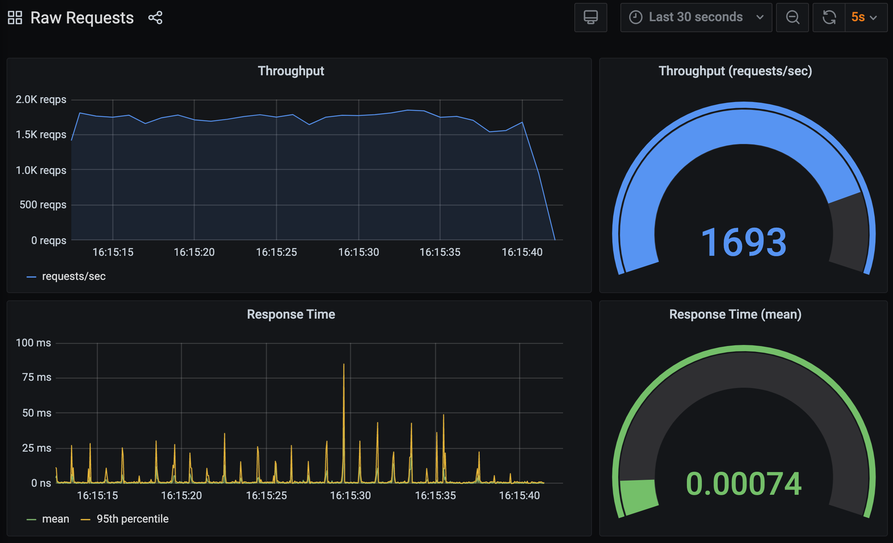
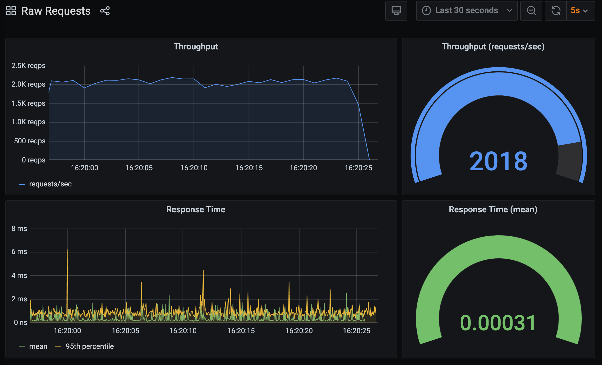

One of the great things about InfluxDB is it's ability to ingest individual events or metrics, as opposed to only working with aggregated metrics. Because you have access to distinct values for each event, HTTP requests in our case, it is possible to go back over the data and generate calculated metrics such as percentiles, which require access to all the original data to calculate.

In the examples we have been using so far, each time a HTTP request occurred we immediately reported a metric back to InfluxDB. This means that for every inbound HTTP request being handled by our application, we were creating an outbound request to InfluxDB. This has a significant cost and since our WSGI application was just a hello world application, the overhead of sending the data to InfluxDB was way more than that of our application. This approach has therefore been dramatically affecting the potential throughput of our application.

The recommended approach to avoid this when working with InfluxDB is to batch up data, and only periodically report it. This version of our code can be found in `~/exercises/hello-world-v4/metrics.py`.

```editor:open-file
file: ~/exercises/hello-world-v4/metrics.py
```

Rather than a `report_metric()` function which immediately sends the metric to InfluxDB, we have `record_metric()` which records the details of the metric as a dictionary, and adds it to a list of metrics for the current reporting period.

```editor:execute-command
command: workbench.action.findInFiles
args:
- query: "def record_metric\\(.*\\):"
  filesToInclude: hello-world-v4/metrics.py
  isRegex: true
```

We then have a background thread which once a second, will send the list of accumulated metrics to InfluxDB in one go.

```editor:execute-command
command: workbench.action.findInFiles
args:
- query: "def report_metrics\\(.*\\):"
  filesToInclude: hello-world-v4/metrics.py
  isRegex: true
```

Start up the WSGI application using this variation of the code:

```terminal:execute
command: mod_wsgi-express start-server hello-world-v4/wsgi.py --log-to-terminal --working-directory hello-world-v4
```

and run `bomardier` to generate the requests against it.

```terminal:execute
command: bombardier -d 120s -c 5 http://localhost:8000
session: 2
```

Head back to the **Raw Requests** dashboard in Grafana.

```dashboard:reload-dashboard
name: Grafana
url: {{ingress_protocol}}://{{session_namespace}}-grafana.{{ingress_domain}}{{ingress_port_suffix}}/d/raw-requests?orgId=1&refresh=5s
```

This time you should see that the throughput achieved is significantly more. This is because of the reduction in overhead by batching up metrics and only sending them periodically.



You will also see that the response time is improved, however, it isn't all good news.

The problem now is that due to the larger number of requests, we get a big spike in the response time coinciding with when the metrics are being reported to InfluxDB.

In this case the issue is actually how the InfluxDB client processes the metrics when received in a batch.

Before we continue, kill `bombardier` if it is still running, as well as the WSGI application.

```terminal:interrupt-all
```

When using the Python InfluxDB client you can provide metrics in two forms. The first is a list of dictionaries, where each dictionary records one data point.

It turns out that when the Python client goes on to process a list in this form, it is very inefficient at doing it. This is because when presented data in this form it will convert the whole list to a JSON string and then send it.

The way to avoid this overhead as [recommended by InfluxDB](https://www.influxdata.com/blog/writing-data-to-influxdb-with-python/) is to use the second form for passing metrics to the Python InfluxDB client. This is called the InfluxDB line protocol.

Rather than accumulating metrics as a list of dictionaries, a list of strings is used, where each string in the list is a formatted version of a single metric.

For this version see `~/exercises/hello-world-v5/metrics.py`.

```editor:open-file
file: ~/exercises/hello-world-v5/metrics.py
```

The only difference is in the `record_metric()` function.

```editor:execute-command
command: workbench.action.findInFiles
args:
- query: "def record_metric\\(.*\\):"
  filesToInclude: hello-world-v5/metrics.py
  isRegex: true
```

Start up the WSGI application again:

```terminal:execute
command: mod_wsgi-express start-server hello-world-v5/wsgi.py --log-to-terminal --working-directory hello-world-v5
```

Send through the requests:

```terminal:execute
command: bombardier -d 120s -c 5 http://localhost:8000
session: 2
```

and load up the **Raw Requests** dashboard in Grafana.

```dashboard:reload-dashboard
name: Grafana
url: {{ingress_protocol}}://{{session_namespace}}-grafana.{{ingress_domain}}{{ingress_port_suffix}}/d/raw-requests?orgId=1&refresh=5s
```

You will see that throughput has increased again, and the response time is also better, without the periodic spikes in response time when the batched metric data was being reported.



We therefore appear to now have suitable code for instrumenting our WSGI application.

Stop `bombardier` if it is still running, as well as the WSGI application.

```terminal:interrupt-all
```
