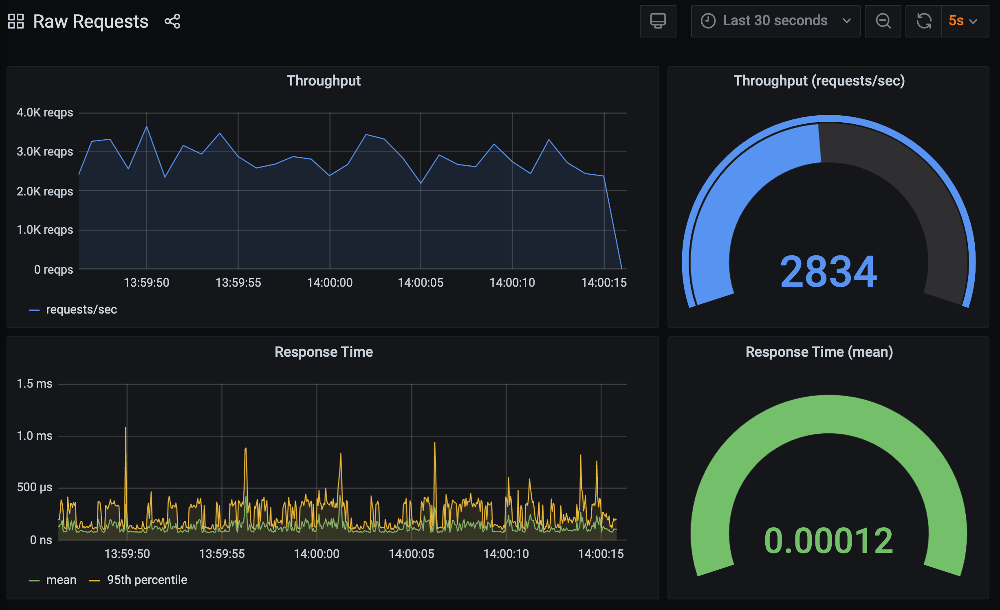
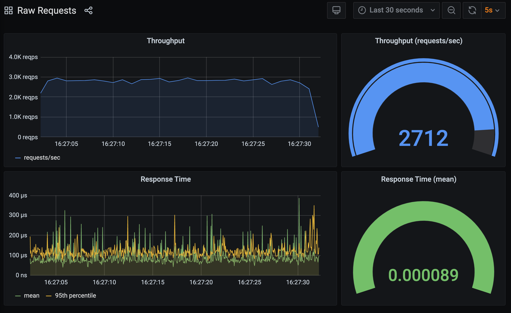

To illustrate that the approach to instrumenting a WSGI application isn't only suitable for `mod_wsgi`, let's try it with `gunicorn` instead.

Start up the WSGI application, but this time using `gunicorn` instead of `mod_wsgi-express`.

```terminal:execute
command: gunicorn --pythonpath hello-world-v5 wsgi
```

Generate the HTTP traffic using `bombardier`:

```terminal:execute
command: bombardier -d 120s -c 5 http://localhost:8000
session: 2
```

and switch to the **Raw Requests** dashboard in Grafana.

```dashboard:reload-dashboard
name: Grafana
url: {{ingress_protocol}}://{{session_namespace}}-grafana.{{ingress_domain}}{{ingress_port_suffix}}/d/raw-requests?orgId=1&refresh=5s
```

As before with `mod_wsgi`, you will see details of the requests as received.



Compare the results against what we got for `mod_wsgi` and you may at this point be thinking why I am bothering even considering using `mod_wsgi`, as `gunicorn` is obviously better.

Before you abandon working your way through this workshop, this is where you need to realise that pretty well all benchmarks you might find comparing Python WSGI servers are bogus for one reason or another.

The problem with running benchmarks comparing Python WSGI servers is ensuring that you are doing a like for like comparison, and where you use the default options that the various WSGI servers use, that isn't going to happen.

In the case of `gunicorn`, it defaults to a single process, where that single process is only capable of handling one request at a time. This may be fine for a CPU bound application with very small response times, and will get you quite far, even with only a single process, but it isn't a realistic configuration for what you would need for a typical production web site using Python.

To illustrate this, let's re-run `mod_wsgi-express` but with a similar configuration to `gunicorn`, which targets the same sort of application profile.

```terminal:execute
command: mod_wsgi-express start-server hello-world-v5/wsgi.py --log-to-terminal --working-directory hello-world-v5 --processes=1 --threads=1 --server-mpm=prefork --keep-alive-timeout=2
```

Strictly speaking keep alive connections aren't going to be used in this case, but since `gunicorn` has that as a default, lets enable it as well.

Start up `bombardier` to generate the requests:

```terminal:execute
command: bombardier -d 120s -c 5 http://localhost:8000
session: 2
```

and yet again jump back to the the **Raw Requests** dashboard in Grafana.

```dashboard:reload-dashboard
name: Grafana
url: {{ingress_protocol}}://{{session_namespace}}-grafana.{{ingress_domain}}{{ingress_port_suffix}}/d/raw-requests?orgId=1&refresh=5s
```

This time you will see that the results are much more in the favour of `mod_wsgi` over `gunicorn`.



The reason for the difference is that the default configuration used by `mod_wsgi-express` favours a WSGI application which has a bias to being I/O bound rather than CPU bound. As such, the default configuration for `mod_wsgi-express` is a single process with five threads for handling requests. Further, Apache itself is configured to use the `event` or `worker` MPM in preference to the `prefork` MPM.

Overall the aim of the defaults for `mod_wsgi-express` is to provide an out of the box configuration more suitable to a typical Python web application implemented using one of the many high level Python web frameworks, talking to a backend database for site data storage. It defaults to using multithreading to handle concurrent requests, rather than processes, thus keeping memory usage down.

The default out of the box configurations for `mod_wsgi` and `gunicorn` aren't therefore going to be comparible. Unfortunately, people who create benchmarks comparing Python WSGI servers don't usually pay too much attention to setting up configurations so they can realistically be compared. In other words, benchmarks you find are usually rubbish and aren't usually going to be relevant at all to your own requirements.

As such, using benchmarks to try and evaluate which Python WSGI server you use is mostly a waste of time. Your choice of Python WSGI server should be based on the features of the server, and the flexibility it has for being deployed with different configurations, so that you can then tune it to suit the specific requirements of your Python WSGI application.

So ignore Python benchmarks, including the one used to demonstrate the point above. In this case you would usually never run a Python WSGI server with only one process and one thread. In order to handle concurrent requests at the same time on the same machine, you are going to have scale up either the number of processes or threads, but which way you scale things will depend on the balance your application has between being CPU bound and I/O bound. Even then it isn't that simple though, as your web application isn't going to respond to the one specific HTTP request all the time. The profile of different HTTP requests you handle can vary quite significantly, and trying to handle them all in the one Python WSGI server can be detrimental to the overall server performance. Often it is better to use multiple distinct instances of the Python WGSI server, each configured differently, and proxy HTTP requests with a specific runtime profile to a WSGI server with matching configuration.
