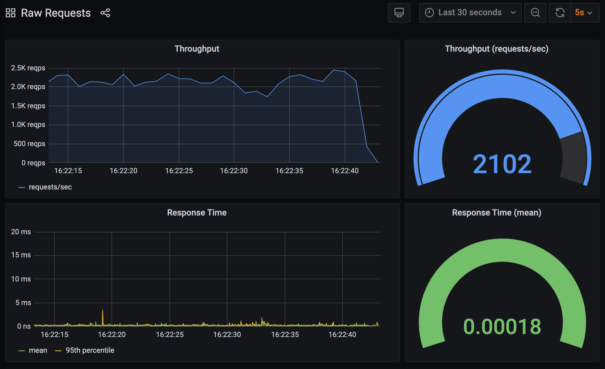
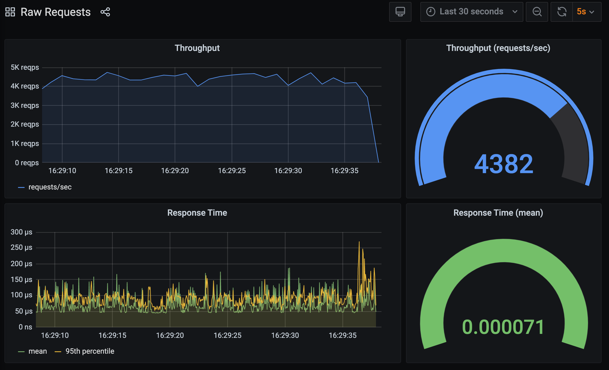

The code used here to instrument the WSGI application should work with any compliant WSGI server, including in production deployments.

In addition to using it to monitor your production applications, it can be used to help evaluate the suitability of different WSGI servers, or particular WSGI server configurations.

On this latter point a word of warning. If you are going to try and compare the performance of different WSGI servers, it is not enough to blindly run each with their default configurations and a simple WSGI hello world application as the default configurations of the mainstream WSGI servers are set up with quite different goals in mind. A consequence of using the default configurations is that you can get misleading results which are completely bogus as far as helping to evaluate the suitability of the WSGI server for your specific WSGI application.

To illustrate this, let's try a number of custom configurations for `mod_wsgi-express`, rather than using its default.

First up, rather than using the default configuration of a single process with 5 threads for handling requests that ``mod_wsgi-express`` uses, wind back the number of threads to just 1. This brings `mod_wsgi-express` closer to what other WSGI servers such as `gunicorn` and `uWSGI` use as their default.

```terminal:execute
command: mod_wsgi-express start-server hello-world-v5/wsgi.py --log-to-terminal --working-directory hello-world-v5 --processes=1 --threads=1
```

Start up `bombardier` to generate the requests:

```terminal:execute
command: bombardier -d 180s -c 3 http://localhost:8000
session: 2
```

Bring up the **Raw Requests** dashboard in Grafana.

```dashboard:reload-dashboard
name: Grafana
url: {{ingress_protocol}}://{{session_namespace}}-grafana.{{ingress_domain}}{{ingress_port_suffix}}/d/raw-requests?orgId=1&refresh=5s
```

You should see that the results for `mod_wsgi-express` express have improved. This is because the high CPU requirement of a WSGI hello world application means that a single thread process will perform better than if it is multithreaded. This is a consequence of how the global interpeter lock (GIL) in Python affects multithreaded applications. The nature of the impacts is such that performance better even though the notional capacity of the WSGI server was reduced.



Next we can start tweaking the configuration by disabling some features, which although they make the WSGI server more durable to application issues, can affect performance. The first feature to disable is automatic process reloading when the WSGI application script file is modified, and the second is disabling the queue timeout used to fail requests when they have been waiting too long to be handled. The latter feature is enabled by default as a way to try and help a WSGI server recover automatically when it is temporarily overloaded, instead of request getting backed up for an extended time, or a full server restart being required.

```terminal:execute
command: mod_wsgi-express start-server hello-world-v5/wsgi.py --log-to-terminal --working-directory hello-world-v5 --processes=1 --threads=1 --disable-reloading --queue-timeout=0
```

Start up `bombardier` to generate the requests:

```terminal:execute
command: bombardier -d 180s -c 3 http://localhost:8000
session: 2
```

and yet again jump back to the **Raw Requests** dashboard in Grafana.

```dashboard:reload-dashboard
name: Grafana
url: {{ingress_protocol}}://{{session_namespace}}-grafana.{{ingress_domain}}{{ingress_port_suffix}}/d/raw-requests?orgId=1&refresh=5s
```

A minor performance improvement should again be evident.


We aren't done yet though, as `mod_wsgi-express` will use daemon mode of `mod_wsgi` by default. In this mode the WSGI application runs in separate processes to the Apache worker processes and requests have to be proxied from the Apache worker processes through to the WSGI application processes.

This mode of operation is the recommended default because it provides many more features which allow you to set up your WSGI application to automatically recover in a range of situations. Where you are confident your application is very robust and doesn't need these features, you can instead use embedded mode of `mod_wsgi`.

To try this mode of `mod_wsgi`, stop `bombardier` if it is still running, as well as the WSGI application.

```terminal:interrupt-all
```

Run `mod_wsgi-express` again with the same configuration but enable embedded mode instead.

```terminal:execute
command: mod_wsgi-express start-server hello-world-v5/wsgi.py --log-to-terminal --working-directory hello-world-v5 --processes=1 --threads=1 --embedded-mode
```

Start up `bombardier` to generate the requests:

```terminal:execute
command: bombardier -d 180s -c 3 http://localhost:8000
session: 2
```

and head back to the **Raw Requests** dashboard in Grafana.

```dashboard:reload-dashboard
name: Grafana
url: {{ingress_protocol}}://{{session_namespace}}-grafana.{{ingress_domain}}{{ingress_port_suffix}}/d/raw-requests?orgId=1&refresh=5s
```

The performance from `mod_wsgi` with this configuration is quite a bit better than `gunicorn`. Do keep in mind though that when using `gunicorn` it is actually recommended you place it behind an `nginx` proxy. This extra layer will mean that overall `gunicorn` performance could be worse than what we got here. For `mod_wsgi` you don't need an additional proxy in front, as Apache already provides the isolation required that `nginx` is recommended for when using `gunicorn`.



Now, although embedded mode provides much better performance, you should only use it when you have a need for it, as you do loose various builtin protections that daemon mode provides. You also still need to ensure you tune the configuration correctly for your WSGI application else you could end up with worse performance.

Overall the aim of the defaults for `mod_wsgi-express` and daemon mode is to provide an out of the box configuration more suitable to a typical Python web application implemented using one of the many high level Python web frameworks, talking to a backend database for site data storage. It defaults to using multithreading to handle concurrent requests, rather than processes, thus keeping memory usage down.

The default out of the box configurations for `mod_wsgi` and `gunicorn` aren't therefore going to be comparable. Unfortunately, people who create benchmarks comparing Python WSGI servers don't usually pay too much attention to setting up configurations so they can realistically be compared. In other words, benchmarks you find are usually rubbish and aren't usually going to be relevant at all to your own requirements.

As such, using benchmarks to try and evaluate which Python WSGI server you use is mostly a waste of time. Your choice of Python WSGI server should be based on the features of the server, and the flexibility it has for being deployed with different configurations, so that you can then tune it to suit the specific requirements of your Python WSGI application.

So ignore Python benchmarks, including the one used to demonstrate the point above. You would usually never run a Python WSGI server with only one process and one thread, thus it is hardly going to be relevant either.

In order to handle concurrent requests at the same time on the same machine, you are going to have to scale up either the number of processes or threads, but which way you scale things will depend on the balance your application has between being CPU bound and I/O bound, the response times for your application, and how much CPU and memory resources you have. Beyond a certain point you will have no choice but to start scaling across multiple hosts and it will not be possible to do everything with a single host.

Even then it isn't that simple though, as your web application isn't going to respond to the one specific HTTP request all the time. The profile of different HTTP requests you handle can vary quite significantly, and trying to handle them all in the one Python WSGI server can be detrimental to the overall server performance. Often it is better to use multiple distinct instances of the Python WSGI server, each configured differently, and proxy HTTP requests with a specific runtime profile to a WSGI server with matching configuration.

Understanding all this is where instrumenting your WSGI application and extracting metrics is so important. So definitely use metrics to evaluate the performance of your real Python web application, but don't waste your time using them with a hello world application in order to evaluate different Python WSGI servers as it is usually not going to yield anything useful later on for when you deploy your actual application.

Before continuing, stop `bombardier` if it is still running, as well as the WSGI application.

```terminal:interrupt-all
```
